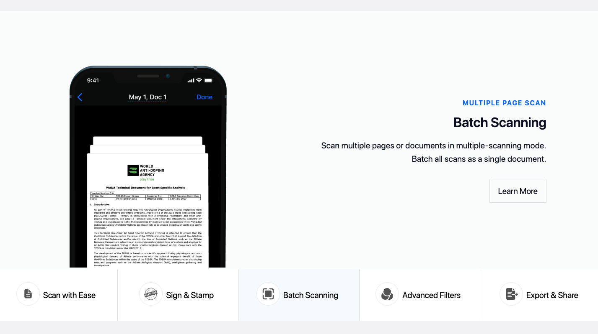

# Animation Tabs // FE Assigment

In this project, I developed an animated tab system using React and Framer Motion. Instead of relying solely on the provided repository as a base, I opted to showcase how I utilize CSS technology by using SASS with a Pure-CSS approach. If desired, I can also experiment with Tailwind.

To achieve the pixel-perfect result matching the provided Figma design, I created my own grid and typography system using SASS.

This project is best viewed at 1440px on desktop and 375px on mobile.

In a modular structure, components can be reused and customized to be styled exactly as I wish.


## Screenshots

### Desktop View


### Mobile View


## Setup

```bash
npm install
npm run dev
```
